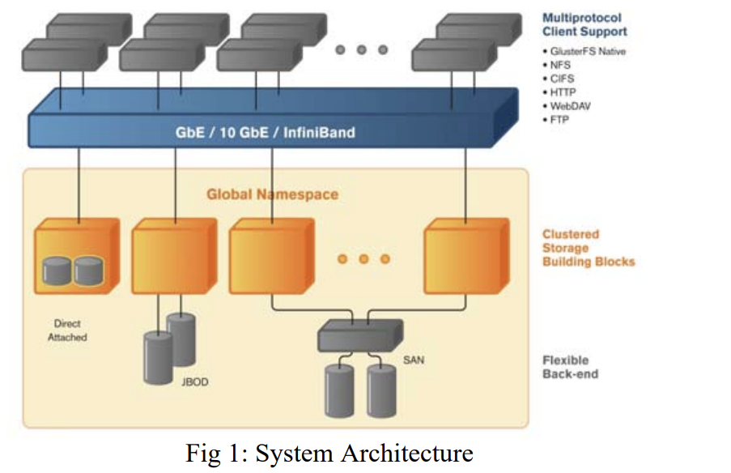

# Clustering

## Theory 

### Clustering-Computing
- Cluster computing is a type of computing where multiple computers are connected so they work together as a single system.
- The word "Cluster" refers to a network of linked computer systems to perform the same task. 
- Computing clusters typically consist of servers, workstations and personal computers that comunicate over a local area network (LAN)
-  How it works:
    - at the fundamental level, cluster computing uses a LAN to connect multiple independent computer in a network 
    - Every cluster consists of multiple computers (nodes), which are controlled by middleware (software that enables communication between machines).

#### Architecture 
- Cluster Computing consists of a group of interconnected individual computers working together as a single machine 
- Each Ressource is linked via a high-speed-connection such as LAN. 
- Each Node has OS, memory, input-output (I/O) functions.

- cluster-types: 
    - open cluster
        - each computer has its own IP-Adress
    - closed cluster
        - each node is hidden behind a gateway node.
[Source1](https://www.ibm.com/think/topics/cluster-computing?utm_source=chatgpt.com)
[Source2] (https://www.linux.com/training-tutorials/building-beowulf-cluster-just-13-steps/?utm_source=chatgpt.com)

#### Clusture-filesystem

Definition: Distributed file system 

- User data is stored in distributed manner 
- Users feel that the file is part of their local system, while he is unaware of the storage in the backend.
- Application of such files are in big system and distributed in the nature of railway systems

System-Architecture:
- Islayered
- System architecture is as shown in picture 

- The infiband is a network used to connect nodes (Server Pool).
- User can use the native language of GlusterFs or HTTP or FTP.

Architecture-Components:
- Server Storage Pool
    - storage nodes which create a global namespace
    - There is also a trusted server-pool. Nodes need to be invited in order to contribute in it.
    - Members can be dynamically added/removed.
- storage client
    - any client able to connect with linux file system with any of NFS, CFS, HTTP, FTP
- Fuse
    - Makes it possible to implement a fully functional filesystem with a userspace program.
    - Features include:
        - API-Library
        - Secure Implementation
        - Stable over time
    - 